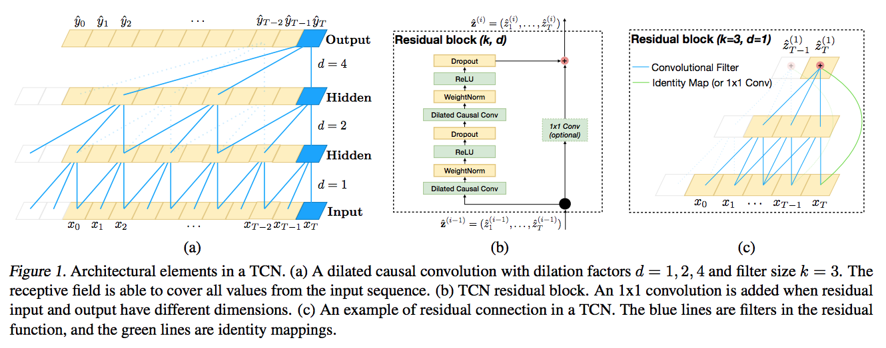

# An Empirical Evaluation of Generic Convolutional and Recurrent Networks for Sequence Modeling

|||
| --- | --- |
| Title | An Empirical Evaluation of Generic Convolutional and Recurrent Networks for Sequence Modeling |
| Authors | Shaojie Bai, J. Zico Kolter, Vladlen Koltun |
| Year | 2018 |
| URL | https://arxiv.org/abs/1803.01271 |

Since the Deep Learning revolution in NLP, sequence modelling tasks have typically
been addressed with recurrent networks such as LSTMs. Bai et al. argue that 
this automatic reflex should be reconsidered, as convolutional architectures often 
outperform recurrent ones. 

They investigate a so-called Temporal
Convolutional Network (TCN): a deep convolutional network that

- only looks to the past, i.e. the left context of each token,
- uses dilated convolutions to grow the receptive field exponentially
beyond the size of the filter, and
- incorporates residual connections to avoid vanishing or exploding gradients in
very deep networks. 

The benefits of this architecture are its parallellism, flexible receptive field size,
stable gradients, low memory requirement for training, and its ability to deal with 
variable-length inputs. Moreover, Bai et al.'s experiments show it tends to outperform traditional recurrent
models across a wide range of tasks, including NLP tasks such as word-level and
character-level language modelling.
