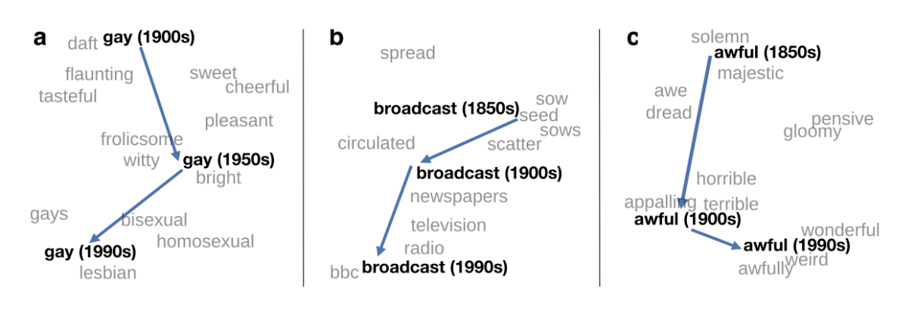

# Diachronic Word Embeddings Reveal Statistical Laws of Semantic Change

|||
| --- | --- |
| Title | Diachronic Word Embeddings Reveal Statistical Laws of Semantic Change |
| Authors | William L. Hamilton, Jure Leskovec, Dan Jurafsky |
| Year | 2016 |
| URL | https://aclanthology.info/pdf/P/P16/P16-1141.pdf |

Hamilton et al. model changes in word meaning by fitting word embeddings on consecutive
corpora of historical language. They compare several ways of quantifying meaning 
(co-occurrence vectors weighted by PPMI, SVD embeddings and word2vec embeddings), and align
historical embeddings from different corpora by finding the optimal rotational alignment
that preserves the cosine similarities as much as possible. 

First, Hamilton et al. show their diachronic word embeddings can be used to discover well-known
semantic shifts, such as the shift of meaning from "happy" to "homosexual" in the word _gay_. 
These shifts can be modelled by the changing cosine similarities between the target word
and a set of reference words, or by measuring the cosine similarity between two historical
word embeddings of the target word. They find both SVD and word2vec give good results, but word2vec embeddings are generally the most
useful for discovering and visualizing meaning shifts.

Next, they fit a linear mixed model to the semantic displacement figures of 10,000 words, to 
model the influence of polysemy and frequency on the rate of change. Their results
point to the existence of two linguistic laws: the _law of conformity_ says that
frequent words are less sensitive to meaning change, while the _law of innovation_ says
that polysemous words are more amenable to new meanings.