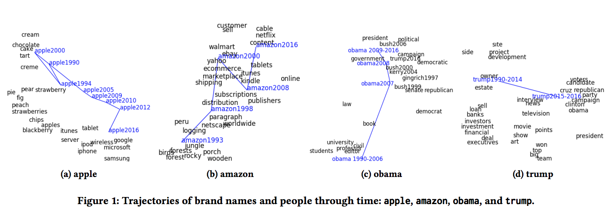

# Dynamic Word Embeddings for Evolving Semantic Discovery

|||
| --- | --- |
| Title | Dynamic Word Embeddings for Evolving Semantic Discovery |
| Authors | Zijun Yao, Yifan Sun, Weicong Ding, Nikhil Rao, Hui Xiong |
| Year | 2018 |
| URL | https://arxiv.org/abs/1703.00607 |

Like [Hamilton et al. (2016)](Diachronic%20Word%20Embeddings%20Reveal%20Statistical%20Laws%20of%20Semantic%20Change.md), Yao et al. present an application of word embeddings
to semantic change, where temporal embeddings 
are used to model word meaning in a specific
time period. The key challenge in this application is
that embeddings that are learnt independently from different corpora are not
aligned and cannot be compared across time periods. Where
previous approaches have used a two-step procedure of first learning and 
then aligning the embeddings, Yao et al.'s model learns all word embeddings 
jointly and enforces alignment through regularization. 
They argue this gives better results than the two-step methods, 
and is more robust against data sparsity: it is possible to have time slices
where specific words are rare or missing. 

Yao et al. evaluate their model on a set of news articles from the New York Times 
between 1990 and 2016. A qualitative evaluation of the trajectories of relevant
words such as Apple, Amazon, Obama and Trump shows their temporal embeddings
indeed capture the shift in meaning or use these words have gone through. Moreover,
temporal neighbours are often conceptually equivalent to the query term. For example,
looking for the temporal embeddings most similar to "Nadal" in 2010 returns the 
first-ranked ATP player for 15 of the 25 other years in the corpus. A quantitative 
evaluation of the resulting embedding clusters and alignments finally confirms 
the superiority of this approach to competing techniques.