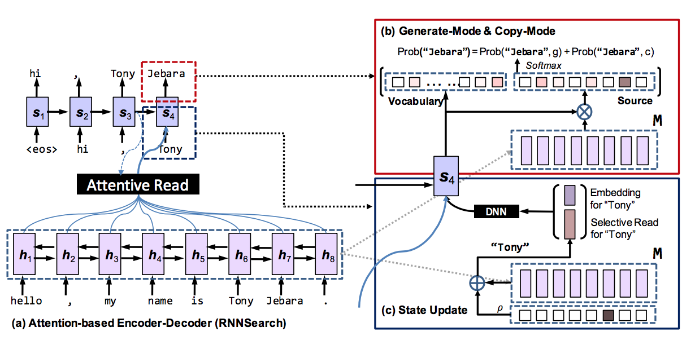

# Incorporating Copying Mechanism in Sequence-to-Sequence Learning

|||
| --- | --- |
| Title | Incorporating Copying Mechanism in Sequence-to-Sequence Learning |
| Authors | Jiatao Gu, Zhengdong Lu, Hang Li, Victor O.K. Li |
| Year | 2016 |
| URL | https://arxiv.org/pdf/1603.06393 |

Gu et al. present a hybrid between Vinyals' et al.'s Pointer Networks and 
Bahdanau et al.'s attention-based seq2seq network. In CopyNet, the output
vocabulary is the union of the standard vocabulary, the unknown token, and 
the vocabulary in the input sequence. The probability of generating a given
target word is computed as the sum of its generation probability and its copy
probability. While the generation mode is the same as Bahdanau et al.'s 
encoder-decoder mechanism, the copy mode uses both semantic (embedding) and location
information (the so-called "selective read") about the words in the input to compute their copy probability. 

Gu et al. argue their model is particularly useful for applications in NLP where 
often parts of the input are copied, such as dialogue generation and 
text summarization. Three experiments on artificial and natural datasets show
CopyNet has the potential to clearly beat the competitors in these applications. 